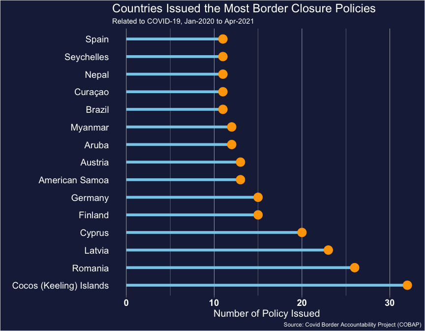

International Travel Bans Policies in the COVID-19 pandemic year 2020
================
Thuy Nguyen

## Introduction

“The COVID Border Accountability Project (COBAP) provides a dataset of
\>1000 policies systematized to reflect a complete timeline of new
country-level restrictions on movement across international borders”.

Our full dataset is hosted here:
<https://dataverse.harvard.edu/dataset.xhtml?persistentId=doi:10.7910/DVN/U6DJAC>

``` r
library(readxl)
library(tidyverse)
library(dplyr)
library(janitor)
library(lubridate)
library(ggplot2)
library(forcats)
```

## Read in data

``` r
d <- rio::import(here::here("data", "policy_list.csv")) %>% 
  select(1:23) %>% 
  janitor::clean_names() 

# convert to date format, select needed columns
data <- d %>% 
  mutate(start_asdate = lubridate::mdy(d$start_date), # date format mm_dd_yyyy
         end_asdate = lubridate::mdy(d$end_date)) %>% 
  select(c(country_name, iso3, policy_type, air, land, sea, start_asdate, end_asdate)) %>% 
  drop_na()
```

``` r
# data for the line chart
 pd_line <- data %>% 
  #count in week interval
  select(country_name, iso3, start_asdate) %>% 
  add_count(week = floor_date(start_asdate, "week")) %>% 
  arrange(start_asdate) %>% 
  drop_na()
```

### Plot 1: Overall polices

``` r
# plot
  p_allpolicies <- pd_line %>% 
  ggplot(aes(week, n)) +

  geom_vline(xintercept = as.Date("2020-03-11"), linetype = "dotted", color = "#780A0B") +
   geom_text(label = "Pandemic declared (March 11)", 
             size = 3, color = "#780A0B", hjust = -0.5,
             x = as.Date("2020-02-26"), # arbitrary date to make sure the text does not cross the vline
             y = 250
            ) + 
  geom_point(aes(week, n), size = 6, shape = 21, fill = "#3E80B6", color = "#3E80B6") +

  geom_line(color = "#3E80B6", size = 1) +
  
  #show values inside the points
  geom_text(aes(label = n),
            color = "white",
            size = 3) + 
  scale_x_date(date_breaks = "1 month", date_labels = "%b %d") +
 
  # First country to adop a boder closure American\Samoa; 
    annotate(geom = "text", 
                 x = as.Date("2020-01-15"), 
                 y = .5,
                label = "American\nSamoa", vjust = -1.5, hjust = 0.9, color = "#3E80B6") +
                
    annotate("segment", x = as.Date("2020-01-01"), xend = as.Date("2020-01-01"), 
               y = 27, yend = 3, colour = "#3E80B6", size=.5, alpha = .5) +   
  
  #countries adopted policies during the second week 2020-Jan-26 to end of 2020-Feb-01
 
  annotate(geom = "text", 
                 x = as.Date("2020-01-26"), 
                 y = .5,
                label = "Mozambique\nSingapore\n", vjust = -4, hjust = 1, color = "#3E80B6") +
  
  annotate(geom = "text", 
                 x = as.Date("2020-01-26"), 
                 y = .5,
                label = "Israel\nItaly\nPakistan\nRussia\nPalau\nMongolia", vjust = -1, hjust = 0, color = "#3E80B6") +
                
    annotate("segment", x = as.Date("2020-01-26"), xend = as.Date("2020-01-26"), 
               y = 135, yend = 10, colour = "#3E80B6", size=.5, alpha = .5) +
  labs(x = "",
       y = "",
       title = "Number of Border Closure Policies Adopted Due to COVID - 19 by Countries", 
       subtitle = "11 policies were issued by 8 countries between Jan-26 to Feb-01-2020",
       caption = "Source: Covid Border Accountability Project (COBAP)") +
  theme_light()
#ggsave("p_allpolicies.png", p_allpolicies, width = 9, height = 7, units = "in")
 p_allpolicies
```

<!-- -->

### Plot 2: Countries with high number of border close policies issued

``` r
# Countries issued more than 10 policies
more10policies <- data %>% 
  group_by(country_name) %>% 
  count() %>% 
  filter(n > 10) %>%
  arrange(desc(n)) %>% 
  mutate(country_name = as.factor(country_name)) %>% 
  mutate(country_name = fct_relevel(country_name, "Cocos (Keeling) Islands", "Romania", "Latvia", "Cyprus", "Finland", "Germany", "American Samoa", "Austria", "Aruba", "Myanmar", "Brazil", "Curaçao", "Nepal", "Seychelles", "Spain"))

  #plot
p_more10 <- more10policies %>%   
ggplot(aes(country_name, n)) +
  geom_segment(aes(x = country_name, xend = country_name, y = 0, yend = n), color = "skyblue", size = 1) +
  geom_point(color = "orange", size = 4) +
  labs(
    title = "Countries Issued More Than 10 Border Closure Policies\nRelated to COVID-19, Jan-2020 ~ Apr-2021",
    x = "",
    y = "Number of Policy Issued",
    caption = "Source: Covid Border Accountability Project (COBAP)"
  ) +
  theme_light() +
  coord_flip() +
  theme(
    panel.grid.major.y = element_blank(),
    panel.border = element_blank(),
    axis.ticks.y = element_blank()
  )

#ggsave("p_more10.png", p_more10, width = 9, height = 7, units = "in")
p_more10
```

<!-- -->

Authors of the dataset: Shiraef, Mary A.; Weiss, Mark A.; Hirst, Cora;
Walker, Bryn; Nguyen, Thuy; Kline, Camilla; Bhaskaran, Aadya; Beling,
Elizabeth; Mattar, Layth; Amme, Matthew; Shum, Maggie; Sweere, Johanna;
Brantley, Susanna; Schenoni, Luis; Lewis-Beck, Colin; Selvaraj,
Yashwini; Jackson, Cayleigh; Lazar, Nikolas; Musetti, Rachel; Naseer,
Sarah; Taylor, Noah; Gradie, Amalia; Yu, William, 2020, “The COVID
Border Accountability Project (COBAP): Mapping Travel and Immigration
Policy Responses to COVID-19”, <https://doi.org/10.7910/DVN/U6DJAC>,
Harvard Dataverse, V21, UNF:6:51bUOj0lSRrMwups3A7RCg== \[fileUNF\]
